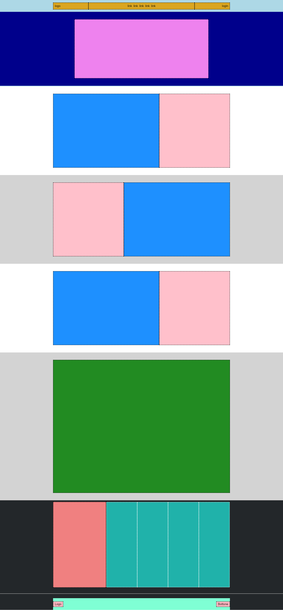

# 🎮 Discord Homepage Structure

This project is a simple structure of the Discord homepage. It provides a basic layout with a header, main section, and footer.

## Project Structure

- `index.html`: The main HTML file.
- `css/style.css`: The CSS file for styling the page.

## Features

- 🖥️ Basic layout with header, main section, and footer.
- 🌐 Navigation links.

## Usage Instructions

1. Open the `index.html` file in a web browser.
2. Explore the basic layout of the Discord homepage.

## Future Improvements

- 📱 Improve responsive design for mobile devices.
- 🌐 Enhance accessibility and SEO.

## Screenshot

